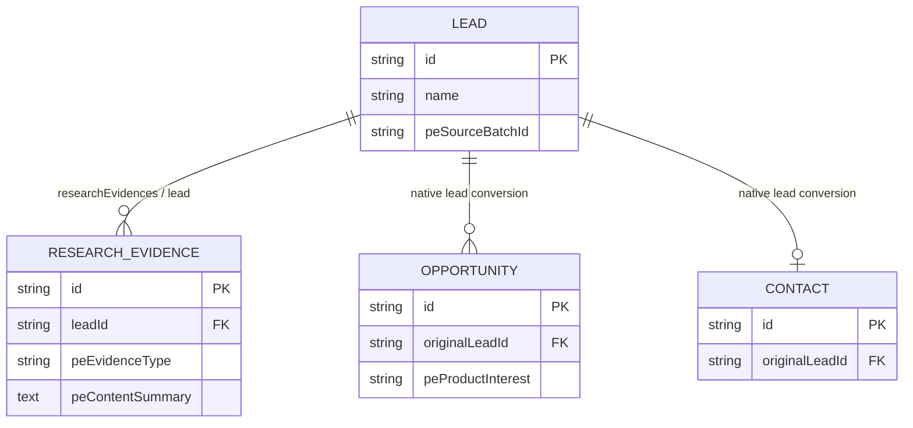

# Phase3B01 — CRM Entity & Data Model Report

**Date:** 2026-07-12  
**Workspace:** `D:\EspoCRM-Production`  
**Extension:** Chitu Prospecting Integration `1.1.0-alpha`  
**Scope:** CRM metadata model, native EspoCRM relationships, base ACL, local EspoCRM-Test verification.

## 1. Existing Audit

| Area | Result | Evidence |
|---|---|---|
| Extension package | PASS | Existing package was installed as `1.0.0-alpha`; it was upgraded locally to `1.1.0-alpha`. |
| Existing entities | PASS | Native `Lead` and `Opportunity` metadata overlays plus custom `ResearchEvidence` already existed. |
| Existing relationship | PASS | `Lead.researchEvidences` (`hasMany`) and `ResearchEvidence.lead` (`belongsTo`) were present and remained unchanged. |
| API exposure | PASS | `ResearchEvidence` has an EspoCRM `Base` scope, ACL-enabled scope, standard Record controller, and native REST API exposure. |
| Naming | PASS | Existing Chitu extension fields use nullable `pe*` names; this phase follows that convention. |
| Connector boundary | PASS | No file under `chitu-connector/` was changed; the existing `pe*` contract fields were retained. |
| B00 baseline | PASS with traceability note | The available B00.1 role-cutover baseline remains intact: this phase does not modify `Integration Bot` or `chitu_ai_connector`. No file named `PHASE3B00.3` exists in this workspace, so that specific artifact cannot be independently re-audited. |

No Chitu Intelligence runtime, scoring logic, AI research runtime, email sending, API route, or production deployment was added.

## 2. Entity List

| Entity | Model role | Implementation |
|---|---|---|
| `Lead` | Native CRM lead plus Chitu intelligence context | Metadata overlay only; no replacement entity. |
| `ResearchEvidence` | Compact website-research evidence | Independent custom entity with native REST record behavior. |
| `Opportunity` | Native CRM opportunity plus intelligence context | Metadata overlay only; no replacement entity. |
| `Contact` | Native conversion/contact object | No custom fields or relationship changes in this phase. |

## 3. Field Mapping

### Lead intelligence layer

| Requested semantic field | EspoCRM field | Type | Ownership / rationale |
|---|---|---|---|
| `company_name` | `name` | native | Reuses existing Lead identity field. |
| `website` | `website` | native | Reuses existing URL field. |
| `country` | `addressCountry` | native | Reuses existing address field. |
| `region` | `addressState` | native | Reuses existing address field. |
| `source_type` | `peSourceType` | varchar(64) | Extensible Chitu source category. |
| `discovery_source` | `peDiscoverySource` | varchar(255) | Discovery channel/reference. |
| `source_batch_id` | `peSourceBatchId` | varchar(128), indexed | Batch traceability. |
| `company_type` | `peCompanyType` | varchar(100) | Chitu classification. |
| `industry` | `peIndustry` | varchar(100) | Chitu classification. |
| `business_model` | `peBusinessModel` | varchar(100) | Chitu classification. |
| `opportunity_score` | `peOpportunityScoreV4` | float 0–100 | Existing connector-compatible score field. |
| `score_grade` | `peScoreTier` | enum | Existing A–D connector-compatible tier. |
| `recommended_product` | `peBestFirstProduct` | varchar(255) | Existing Lead-level Chitu recommendation. |
| `priority_level` | `pePriorityLevel` | enum | `LOW`, `NORMAL`, `HIGH`, `URGENT`. |
| `research_status` | `peResearchStatus` | enum | Existing research lifecycle. |
| `last_researched_at` | `peLastResearchedAt` | datetime | Latest completed research timestamp. |
| `email` | `emailAddress` | native | Reuses EspoCRM email collection. |
| `phone` | `phoneNumber` | native | Reuses EspoCRM telephone field. |
| `contact_form_url` | `peContactFormUrl` | url | Public fallback contact endpoint. |
| `linkedin_url` | `peLinkedinUrl` | url | Public company/contact profile URL. |

All added Lead fields are nullable. `peSourceBatchId` receives the only new index because it is the operational batch lookup key.

### ResearchEvidence

| Requested semantic field | EspoCRM field | Type | Notes |
|---|---|---|---|
| `title` | `name` | native/custom entity name | Relabeled as **Title** in the UI. |
| `evidence_type` | `peEvidenceType` | varchar(100) | Source-format classification. |
| `source_url` | `peSourceUrl` | url | Existing connector-compatible field. |
| `content_summary` | `peContentSummary` | text | Normalized sales-review summary. |
| `confidence` | `peConfidence` | float 0–1 | Existing connector-compatible field. |
| `collected_at` | `peCapturedAt` | datetime | Existing connector-compatible collection timestamp. |

`peClaimType` remains separate from `peEvidenceType`: the former preserves the existing connector contract's business claim classification, while the latter identifies the evidence format.

### Opportunity intelligence

| Requested semantic field | EspoCRM field | Type | Notes |
|---|---|---|---|
| `recommended_product` | `peProductInterest` | varchar(255) | Existing connector-compatible field relabeled **Recommended Product**. |
| `product_fit_score` | `peProductFitScore` | float 0–100 | Chitu fit context; native probability is unchanged. |
| `cooperation_type` | `peCooperationType` | varchar(100) | Suggested cooperation model. |
| `next_action` | `peNextAction` | varchar(255) | Recommended action text; creates no CRM activity. |

Native Opportunity `stage`, `amount`, `closeDate`, account/contact relationships, and conversion behavior are unchanged.

## 4. Relationship Design

| Parent → child | Type | Foreign key / native link | Cascade behavior |
|---|---|---|---|
| `Lead` → `ResearchEvidence` | 1:N | `Lead.researchEvidences` / `ResearchEvidence.lead`; API field `leadId` | No database cascade is declared by this extension. Validation cleanup deletes evidence before Lead. |
| `Lead` → `Opportunity` | Native conversion lifecycle | `originalLeadId` on converted records | Native EspoCRM behavior; untouched. |
| `Lead` → `Contact` | Native conversion lifecycle | `originalLeadId` on converted records | Native EspoCRM behavior; untouched. |

## 5. ACL Matrix

The installable extension exposes `ResearchEvidence` through standard EspoCRM ACL metadata. Role records are provisioned separately by `deployment/provisioning/phase3b01_provision_entity_model_roles.php` so package installation does not mutate users or roles.

| Role | Lead | ResearchEvidence | Opportunity |
|---|---|---|---|
| Admin | Full access | Full access | Full access |
| Sales User | Create/read/edit own records | Read all; no create/edit/delete | Create/read/edit own records |
| Research User | Read all; no create/edit/delete | Create/read/edit all; no delete | No access |
| Integration Bot | Unchanged from B00 baseline | Unchanged from B00 baseline | Unchanged from B00 baseline |

The Sales/User ownership scope is intentionally narrower than global write access. It satisfies the requested read/write capability without opening all records. `Research User` receives no opportunity permission and cannot edit Leads.

## 6. Migration Impact

- Package version advanced from `1.0.0-alpha` to `1.1.0-alpha`.
- EspoCRM rebuild creates nullable custom-field columns and the `peSourceBatchId` index through native metadata processing.
- No SQL migration, direct database write, or EspoCRM core modification is shipped.
- Existing Lead, Opportunity, and ResearchEvidence records remain valid because all newly added fields are nullable.
- The package contains only `manifest.json` and `files/` install content; the role and cleanup scripts are not packaged.

## 7. Validation Results

| Validation | Result | Evidence |
|---|---|---|
| Container health | PASS | `espocrm`, `espocrm-db`, and `espocrm-daemon` were healthy. |
| Extension installation | PASS | Local command installed `Chitu Prospecting Integration` `v1.1.0-alpha`; package is listed as installed. |
| Rebuild / cache clear | PASS | `php command.php rebuild` and `php command.php clear-cache` completed after install. |
| Entity loading / metadata API | PASS | Sales-authenticated API returned all 10 added Lead fields, both added ResearchEvidence fields, all 4 Opportunity fields, and `Lead.researchEvidences`. |
| Relationship API | PASS | Research created an Evidence with `leadId`; Sales retrieved it from `GET Lead/{id}/researchEvidences`. |
| ACL API | PASS | Sales created/updated Lead and Opportunity and read Evidence; Sales Evidence create returned 403; Research read Lead and created/updated Evidence; Research Lead edit returned 403. |
| UI Lead | PASS | Logged in as `sales_test`; Lead form/detail displayed the new source, classification, priority, research timestamp, contact-form, and LinkedIn fields; a marked test Lead was created. |
| UI ResearchEvidence | PASS | Logged in as `research_test`; ResearchEvidence create/detail displayed Title, Evidence Type, Content Summary, and Lead; a marked test Evidence was created. |
| UI relationship | PASS | After linking the Evidence, its UI detail displayed the linked marked Lead. |
| Extension tests | PASS | `python -m unittest discover -s crm-extension/tests -v` — 19 tests passed. |
| Connector tests | PASS | `python -m unittest discover -s chitu-connector/tests -v` — 37 tests passed. |
| Test-record cleanup | PASS | API and UI validation records were removed using the local system-user cleanup script; final API counts were zero. |

## 8. Known Limitations

1. This validation used only the disposable local EspoCRM-Test container; it is not production deployment evidence.
2. The exact `PHASE3B00.3` report/artifact was absent from this workspace. Available B00 baseline artifacts were preserved, but that missing artifact cannot be independently compared.
3. EspoCRM manages the `leadId` relationship field through metadata. This extension does not add a database foreign-key constraint or an automatic delete cascade.
4. This phase adds no import endpoint, sync runtime, workflow automation, email sending, or AI execution.
5. `Contact` retains native EspoCRM conversion behavior; no custom Contact metadata is required for this first data-model version.

## Files Changed

- `crm-extension/manifest.json`
- `crm-extension/Resources/entityDefs/Lead.json`
- `crm-extension/Resources/entityDefs/ResearchEvidence.json`
- `crm-extension/Resources/entityDefs/Opportunity.json`
- `crm-extension/Resources/layouts/Lead/detail.json`
- `crm-extension/Resources/layouts/ResearchEvidence/detail.json`
- `crm-extension/Resources/layouts/ResearchEvidence/list.json`
- `crm-extension/Resources/layouts/Opportunity/detail.json`
- `crm-extension/files/custom/Espo/Modules/Prospecting/Resources/...` matching installable metadata, layouts, and labels
- `crm-extension/tests/test_extension_skeleton.py`
- `deployment/provisioning/phase3b01_provision_entity_model_roles.php`
- `deployment/provisioning/phase3b01_cleanup_validation_records.php`

**Phase3B01 completed. Stop here and await the next phase instruction.**
