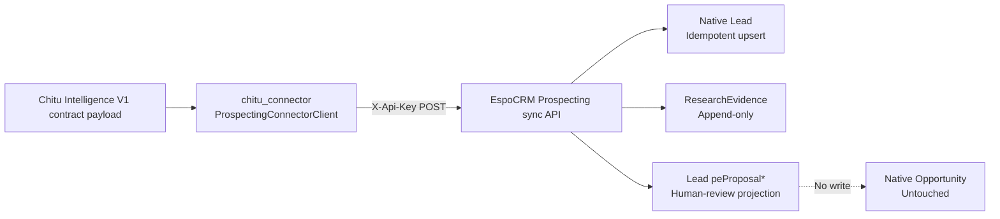

# Phase3B03 — Chitu Connector Sync Layer Report

**Date:** 2026-07-12  
**Workspace:** `D:\EspoCRM-Production`  
**Extension:** Chitu Prospecting Integration `1.3.1-alpha`  
**Scope:** Authenticated Chitu Connector API, Lead idempotent sync, append-only ResearchEvidence sync, and Lead-owned Opportunity Proposal projection.

## 1. Architecture

The only new integration ingress is `chitu_connector.espocrm_sync.ProspectingConnectorClient`. The extension receives the unchanged V1 payload but does not import Chitu runtime, `prospecting_engine`, or Chitu backend modules.

## 2. API

All routes require normal EspoCRM authentication. They deliberately omit `noAuth`, and the service verifies EspoCRM entity ACL before every create, read, or edit operation.

| Route | Purpose | Target | Response |
|---|---|---|---|
| `POST /api/v1/Prospecting/sync/lead` | Idempotent Lead upsert by `identity.candidate_id` | Native `Lead` | `success`, `created`, `updated`, `external_id`, `crm_id` |
| `POST /api/v1/Prospecting/sync/evidence` | Append every item in V1 `evidence[]` | `ResearchEvidence` linked by `leadId` | Required fields plus `crm_ids` and `evidence_count` |
| `POST /api/v1/Prospecting/sync/opportunity-proposal` | Project human-review guidance for score >= 80 | Existing `Lead` `peProposal*` fields | Required fields plus `eligibility`, `action` |

The connector client sends the existing `SyncContractPayload` unchanged with `X-Api-Key`; no new Chitu-side input schema was introduced.

## 3. Mapping

| Chitu V1 source | CRM target | Rule |
|---|---|---|
| `company.name` | `Lead.name`, `Lead.lastName` | Source-owned identity. |
| `company.website` | `Lead.website` | Source-owned identity. |
| `company.country_code` | `Lead.addressCountry` | Direct country mapping. |
| `source.channel` | `Lead.leadSource`, `Lead.peSourceType` | Direct source mapping. |
| `source.source_url` | `Lead.peDiscoverySource` | Direct discovery reference. |
| `research.status` | `Lead.peResearchStatus` | `COMPLETE` maps to `COMPLETED`. |
| `score.value` | `Lead.peOpportunityScoreV4` | V1 score. |
| `recommendation.best_first_product` | `Lead.peBestFirstProduct` | V1 recommended product. |
| `score.value >= 80` | `Lead.pePriorityLevel` | `HIGH`; B02 workflow remains the sole workflow implementation. |
| `evidence[].*` | New `ResearchEvidence` records | V1 items map to Title, Evidence Type, Source URL, Content Summary, Confidence, and Captured At. |

V1 contains no email, phone, cooperation type, or independent product-fit value. Therefore email/phone are not invented or written, `peProposalCooperationType` remains null, and `peProposalProductFitScore` is transparently derived from `score.value`.

## 4. Idempotency and Evidence History

- Lead external identity is `identity.candidate_id` stored in `Lead.peCandidateId`.
- First Lead sync creates; subsequent sync with the same external ID updates the same Lead.
- More than one active Lead with the same external ID is rejected as a conflict.
- Evidence never updates an existing record. Every V1 evidence item creates a new `ResearchEvidence` row linked to the Lead, preserving historical evidence.
- Proposal sync writes only the Lead proposal projection and never creates a second CRM model.

## 5. Opportunity Proposal Safety

The V1 contract remains unchanged, including its `NO_AUTOMATIC_OPPORTUNITY` constraint.

| Proposal field | Lead field | Value |
|---|---|---|
| `recommended_product` | `peBestFirstProduct` | `recommendation.best_first_product` |
| `opportunity_score` | `peOpportunityScoreV4` | `score.value` |
| `product_fit_score` | `peProposalProductFitScore` | Derived from `score.value` |
| `cooperation_type` | `peProposalCooperationType` | `null`; unavailable in V1 |
| `suggested_next_action` | `peProposalSuggestedNextAction` | Human review guidance |
| `eligibility` | `peProposalEligibility` | `true` only when score >= 80; review eligibility, not auto-create authority |
| `action` | `peProposalAction` | Always `NO_AUTOMATIC_OPPORTUNITY` |

No endpoint creates, reads for mutation, or changes `Opportunity`; B02 Opportunity pipeline fields remain untouched.

## 6. Security

- All three custom routes require EspoCRM authentication.
- Anonymous Lead sync returned HTTP `401` in the local runtime.
- Authenticated requests used a disposable API user linked only to the existing `Integration Bot` role.
- The service enforces Lead and ResearchEvidence scope/entity ACL before mutation.
- The temporary local API user was removed after validation.

## 7. Validation Results

| Check | Result | Evidence |
|---|---|---|
| Container health | PASS | `espocrm`, `espocrm-db`, and `espocrm-daemon` healthy. |
| Package install | PASS | Extension installed as `1.3.1-alpha`; rebuild and cache clear completed. |
| PHP lint | PASS | All installable PHP files linted in the EspoCRM PHP container. |
| Anonymous API | PASS | `POST /Prospecting/sync/lead` returned `401`. |
| Lead first sync | PASS | API returned `created=true`, CRM ID `6a537f2a45053efac`. |
| Lead duplicate sync | PASS | Same external ID returned `updated=true` with the same CRM ID. |
| Evidence sync | PASS | One V1 payload with two evidence items created two linked ResearchEvidence records. |
| Proposal sync | PASS | API returned `eligibility=true`, `action=NO_AUTOMATIC_OPPORTUNITY`. |
| Opportunity safety | PASS | Database query found zero `PHASE3B03-TEST%` Opportunity records. |
| Database verification | PASS | Active Lead stored score `80`, product-fit `80`, eligibility `1`, action `NO_AUTOMATIC_OPPORTUNITY`; two active linked Evidence records existed. |
| UI Lead | PASS | Research-user UI showed updated Lead name, site, country, source, score, product, priority, Proposal fields, and sync status. |
| UI Evidence relationship | PASS | Evidence UI showed `test-ev-002` and its linked synced Lead. |
| Final extension regression | PASS | `28` tests passed on 2026-07-12. |
| Final connector regression | PASS | `41` tests passed on 2026-07-12. |
| Final validation cleanup | PASS | Removed the Phase3B03 synthetic Lead, its two linked ResearchEvidence rows, two linked Tasks, and the temporary API identity. |
| Post-cleanup residue check | PASS | `Lead=0`, `ResearchEvidence=0`, `Opportunity=0`, and temporary `User=0` for the `PHASE3B03-TEST` validation scope. |

## 8. Finalization

- Extension manifest version remains `1.3.1-alpha`.
- Contract remains V1 with `contract_version = 1.0`; its final SHA-256 snapshot is `7E4ADDF55A88F4B3DD9D2129A93E729F2422656FAF13E1B8018607AF95FAFE57`.
- Static service verification confirmed no `Opportunity` entity creation path, while the V1 safety action remains `NO_AUTOMATIC_OPPORTUNITY`.
- `peProposalProductFitScore`, `peProposalCooperationType`, `peProposalSuggestedNextAction`, `peProposalEligibility`, and `peProposalAction` remain Lead metadata fields.
- Evidence handling remains append-only: each payload evidence item is instantiated as a new `ResearchEvidence` and saved inside the evidence iteration.

## 9. Known Limitations

1. V1 does not carry email, phone, cooperation type, or a separate product-fit score; the connector does not fabricate these values.
2. ResearchEvidence delivery is intentionally append-only. Retried evidence requests add records rather than overwrite history.
3. This validation used the local EspoCRM-Test Docker stack only; it is not production deployment evidence.
4. EspoCRM applies soft deletion to cleanup records. Validation queries distinguish active records with `deleted=0`.
5. No Opportunity, Account, Contact, email, AI, deployment, or additional workflow functionality was implemented.

## 10. Files Changed

- `chitu-connector/chitu_connector/espocrm_sync/connector_api.py`
- `chitu-connector/chitu_connector/espocrm_sync/__init__.py`
- `chitu-connector/tests/test_espocrm_connector_api.py`
- `crm-extension/files/custom/Espo/Modules/Prospecting/Api/PostSyncLead.php`
- `crm-extension/files/custom/Espo/Modules/Prospecting/Api/PostSyncEvidence.php`
- `crm-extension/files/custom/Espo/Modules/Prospecting/Api/PostSyncOpportunityProposal.php`
- `crm-extension/files/custom/Espo/Modules/Prospecting/Services/ChituSyncService.php`
- `crm-extension/files/custom/Espo/Modules/Prospecting/Resources/routes.json`
- `crm-extension/Resources/routes.json`
- Lead metadata, labels, layouts, manifest, and extension tests
- `deployment/provisioning/phase3b03_provision_connector_test_user.php`
- `deployment/provisioning/phase3b03_cleanup_validation_records.php`

**Phase3B03 completed. Stop here and await Phase3B04 authorization.**
