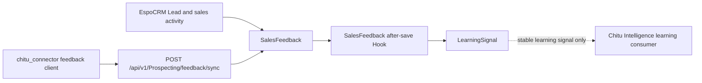

# Phase3B04 — CRM Feedback & Intelligence Loop Report

**Date:** 2026-07-12  
**Workspace:** `D:\EspoCRM-Production`  
**Extension:** Chitu Prospecting Integration `1.4.1-alpha`  
**Runtime:** local EspoCRM-Test Docker stack only  
**Status:** **PASS** — finalization recovery completed (cleanup + minimal API revalidation + relationship checks).

## 1. Architecture

EspoCRM remains the system of record for sales judgment, workflow and outcomes. The connector contains only a typed feedback payload/client; the extension stores feedback and a normalized learning signal. No DeepSeek, scoring engine, research logic, email generation, dashboard or search UI was added. Sync Contract V1 is untouched.

## 2. Entity Design

### SalesFeedback

`SalesFeedback` is a standard EspoCRM module entity with a `Lead` belongs-to link and `Lead.salesFeedbacks` 1:N relationship. It stores `externalLeadId`, an explicit `externalFeedbackId` for idempotency, feedback type/outcome/reason/note, CRM stage/owner, product/product result, connector or manual source, feedback event time, and native `createdAt` audit time.

### LearningSignal

`LearningSignal` is a standard EspoCRM module entity with `Lead.learningSignals` 1:N and `SalesFeedback.learningSignal` 1:1 relationships. It stores only `signalType`, Lead score snapshot as `predictionScore`, `actualOutcome`, product, and native `createdAt`; it does not train or mutate any AI model.

## 3. Feedback Model

Supported `feedbackType` values are `CONTACT_ATTEMPT`, `CUSTOMER_REPLY`, `INTERESTED`, `NOT_INTERESTED`, `NO_RESPONSE`, `WON`, and `LOST`.

Supported `outcome` values are `POSITIVE`, `NEGATIVE`, and `NEUTRAL`. `reason` is a free text field, allowing controlled future extension without changing the enum contract.

## 4. Learning Signal Design

`SalesFeedbackLearningSignalHook` runs after every native SalesFeedback save. It creates the first linked LearningSignal and updates that same signal on later feedback updates. The signal maps feedback type to signal type, feedback outcome to actual outcome, product directly, and captures the existing Lead `peOpportunityScoreV4` as a historical prediction snapshot.

## 5. Connector API

The authenticated endpoint is:

`POST /api/v1/Prospecting/feedback/sync`

Required payload fields are `lead_id`, `feedback_type`, `outcome`, and timezone-aware `timestamp`. Optional stable fields include `feedback_id`, `external_lead_id`, `product`, `product_result`, `stage`, `reason`, and `note`.

The response includes `success`, `external_id`, `accepted`, `created`, `feedback_id`, and `learning_signal_id`. The independent `chitu_connector.espocrm_sync.feedback_api` client serializes this payload without importing Chitu runtime modules or changing Sync Contract V1.

## 6. Security

All custom routes retain EspoCRM's normal authenticated API handling; no `noAuth` route was added. The local Phase3B04 provisioning script configured:

- Admin: full SalesFeedback and LearningSignal access.
- Sales User: create/read/edit own SalesFeedback and read own LearningSignal.
- Research User: read-only access to both entities.
- Integration Bot: create/read/edit SalesFeedback and read-only LearningSignal, with delete denied.

Temporary validation API identity `phase3b04_connector_test` was used only for recovery verification and was removed afterward.

## 7. Idempotency

The caller may send `feedback_id`. The extension looks up `SalesFeedback.externalFeedbackId`: the first request creates the feedback and its LearningSignal; the same ID updates the feedback and reuses the one LearningSignal. If the caller omits `feedback_id`, the service derives a SHA-256 key from Lead ID, feedback type, outcome, product, stage and timestamp. Reusing an external feedback ID for a different Lead is rejected as a conflict.

## 8. Validation Results

### Passed items

| Check | Result | Evidence |
|---|---|---|
| Extension package build | PASS | `prospecting-extension-1.4.1-alpha.zip` built; SHA-256 `80E43D898556F2585DD122628EFF21F4F66193DC58256038470E8C1FD114122A`. |
| Extension runtime load | PASS | Native extension install, rebuild and cache clear completed; `1.4.1-alpha` is installed. |
| PHP lint | PASS | Installed FeedbackSyncService, Hook, SalesFeedback and LearningSignal classes passed `php -l`. |
| Extension regression | PASS | `29` tests passed. |
| Connector regression | PASS | `43` tests passed after B04 connector client/tests were added. |
| Initial authenticated feedback create | PASS | Earlier local synthetic request returned feedback/signal IDs. |
| Initial duplicate feedback submission | PASS | Earlier second request with same external feedback ID completed. |
| LearningSignal generation | PASS | Hook created linked LearningSignal on SalesFeedback save. |
| Initial record-read metadata fix | PASS | `createdAt` metadata corrected and redeployed as `1.4.1-alpha`. |
| Final unauthorized API rejection | PASS | Recovery: `POST /api/v1/Prospecting/feedback/sync` without auth → **HTTP 401**. |
| Final authenticated feedback create | PASS | Recovery: `created=true`, `feedback_id=6a53a2ce6c580f844`, `learning_signal_id=6a53a2ce7126f8093`. |
| Final duplicate feedback submission | PASS | Recovery: same `feedback_id` → `created=false`, identical feedback and learning-signal IDs. |
| SalesFeedback relationship | PASS | Metadata `Lead.salesFeedbacks` / `SalesFeedback.lead`; runtime Lead relation count = 1; feedback.leadId matched seed Lead. |
| LearningSignal relationship | PASS | Metadata `SalesFeedback.learningSignal` / `LearningSignal.salesFeedback` / `Lead.learningSignals`; runtime signal linked to feedback and Lead; Lead relation count = 1. |
| Final synthetic cleanup | PASS | Removed LearningSignal, SalesFeedback, Lead, and `phase3b04_connector_test` User. |
| Post-cleanup residue | PASS | Active counts: API users=0, test Leads=0, test Feedback=0, test Signals=0. |

### Blocked items

| Check | Result | Evidence |
|---|---|---|
| Browser Lead relationship panel UI | BLOCKED (non-blocking for PASS) | Browser automation policy still rejects controlling `http://localhost:8080`. Relationships were verified via EspoCRM metadata + ORM relation queries instead. |

### Remaining validation

1. Optional visual confirmation of Lead relationship panels in a human browser session (not required to keep PASS after ORM/metadata verification).
2. Local Docker healthcheck remains **unhealthy** solely because Cron is disabled — known ambient condition; HTTP 200 and Database/app checks otherwise OK. Not a Phase3B04 functional regression.
3. No production / Railway deployment validation in this phase.

## 9. Limitations

1. The learning signal is stored in EspoCRM for later Chitu consumption; no model training, scoring adjustment or Chitu application modification is implemented.
2. Validation is only against local EspoCRM-Test, not a production deployment.
3. The local runtime reports cron disabled, an existing environment condition unrelated to the feedback API.
4. Browser UI panel inspection remains unverified due to localhost browser-control policy; data relationships were confirmed through runtime ORM/metadata checks during finalization recovery.

## 10. Finalization Recovery (2026-07-12)

Recovery scope was verification-only: no new entities, no connector-contract changes, no business-logic changes, no Phase3B05 work.

Sequence executed:

1. Cleanup of residual `phase3b04_connector_test` (user removed).
2. Temporary re-provision + seed Lead for minimal API checks.
3. Unauthorized / create / duplicate API verification.
4. SalesFeedback + LearningSignal relationship verification.
5. Final cleanup and residue confirmation (all zero).

**PHASE3B04 STATUS: PASS**

**Stop here. Do not enter Phase3B05 without explicit authorization.**
