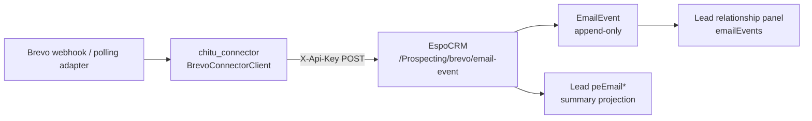

# Phase3B05-A — Brevo Status Sync Layer Report

**Date:** 2026-07-12  
**Workspace:** `D:\EspoCRM-Production`  
**Extension:** Chitu Prospecting Integration `1.5.0-alpha`  
**Runtime:** local EspoCRM-Test Docker stack  
**Status:** **PASS**  
**Boundary:** EspoCRM = CRM SoR; Brevo = send execution; Chitu = research/email generation. No Instantly, no send engine, Phase3B04 contract unchanged.

---

## 1. Architecture

EspoCRM does **not** send outreach email. It stores execution events and refreshes Lead summary fields so sales can see delivery state.

---

## 2. Existing Model Audit

### Lead (pre-existing Phase3A27 fields)

| Field | Type | Role after B05-A |
|---|---|---|
| `peEmailStatus` | enum `NONE/DRAFT_READY/APPROVED/SENT/REPLIED/BOUNCED` | Summary projection; Brevo maps SENT/DELIVERED/OPENED/CLICKED → `SENT` (unless already REPLIED/BOUNCED); REPLIED/BOUNCED sticky |
| `peLastEmailDate` | datetime | Updated from latest Brevo event timestamp |
| `peEmailCampaignName` | varchar | Updated from event `campaign` when present |
| `peEmailReplyStatus` | varchar | Set on REPLIED/BOUNCED events |

Enum was **not** expanded with DELIVERED/OPENED/CLICKED to avoid breaking the existing Chitu `EmailLifecycleSyncService` allowlist. Granular states live on `EmailEvent.eventType`.

### Native EspoCRM entities

| Entity | Role in B05-A |
|---|---|
| `Email` | Untouched — CRM system mail, not Brevo outreach |
| `Task` / Activity | Untouched — no activity auto-creation in this phase |

---

## 3. Brevo Connector Design

Package: `chitu_connector.espocrm_sync.brevo_api`

| Type | Purpose |
|---|---|
| `BrevoEmailEventPayload` | Normalized event: `lead_id`, `message_id`, `event_type`, `timestamp`, optional `campaign` / `external_lead_id` / `reply_status`, `source` |
| `BrevoConnectorClient` | Authenticated POST to `/api/v1/Prospecting/brevo/email-event` with `X-Api-Key` |
| `BrevoEmailEventResponse` | `success`, `accepted`, `created`, `duplicate`, ids |

Supported Brevo aliases → CRM event types:

| Brevo / alias | EmailEvent.eventType |
|---|---|
| `email_sent` / `sent` | `SENT` |
| `email_delivered` / `delivered` | `DELIVERED` |
| `email_opened` / `opened` / `unique_opened` | `OPENED` |
| `email_clicked` / `click` | `CLICKED` |
| `email_replied` / `reply` | `REPLIED` |
| `email_bounced` / `bounce` / hard|soft bounce | `BOUNCED` |

The connector does not call Brevo send APIs and does not import Chitu scoring/email-generation modules.

---

## 4. EmailEvent Entity

Append-only Prospecting module entity with Lead `1:N` link `emailEvents`.

| Field | Notes |
|---|---|
| `leadId` | belongsTo Lead |
| `externalMessageId` | Brevo message id |
| `eventType` | `SENT/DELIVERED/OPENED/CLICKED/REPLIED/BOUNCED` |
| `campaign` | optional |
| `eventAt` | event timestamp |
| `source` | `BREVO` / `CONNECTOR_SYNC` / `MANUAL` |
| `createdAt` | native read-only |

Lead UI: `clientDefs.Lead.relationshipPanels.emailEvents` (create/select disabled; ordered by `eventAt` desc).

---

## 5. Mapping & Idempotency

API: `POST /api/v1/Prospecting/brevo/email-event` → `BrevoEmailEventSyncService`

| Input | CRM target |
|---|---|
| `message_id` | `EmailEvent.externalMessageId` |
| `lead_id` | `EmailEvent.lead` + Lead projection |
| `event_type` | normalized `EmailEvent.eventType` |
| `campaign` | `EmailEvent.campaign` + Lead `peEmailCampaignName` |
| `timestamp` | `EmailEvent.eventAt` + Lead `peLastEmailDate` |

**Idempotency key:** `(externalMessageId, eventType)`

- First occurrence → create EmailEvent (`created=true`, `duplicate=false`) and project Lead summary  
- Repeat → **ignore** mutation; return same `email_event_id` (`created=false`, `duplicate=true`)  
- Same message id + event type on a different Lead → Conflict

Different event types for the same message id remain separate append-only rows (e.g. SENT then DELIVERED).

---

## 6. API Security

- Route has **no** `noAuth`
- Requires EspoCRM authentication (`X-Api-Key` for Integration Bot API users)
- Service enforces Lead read + EmailEvent create / Lead edit ACL
- Unauthorized request validation: **HTTP 401**

Local disposable identity for validation: `phase3b05a_brevo_test` (removed after tests).

---

## 7. Validation Results

| Check | Result | Evidence |
|---|---|---|
| Extension build | PASS | `deployment/prospecting-extension-1.5.0-alpha.zip`; SHA-256 `9FD1F366450BD0E4B555DDF27D3C14BCCF01715B59D3A52326B59347E711CD66` |
| Install / rebuild / cache clear | PASS | `bin/command extension --file=...`; rebuild; clear-cache; installed `1.5.0-alpha` |
| Extension regression | PASS | `30` tests OK |
| Connector regression | PASS | `45` tests OK (includes Brevo client tests) |
| Unauthorized event | PASS | HTTP **401** |
| Sent event | PASS | `created=true`, `event_type=SENT` |
| Delivered event | PASS | `created=true`, `event_type=DELIVERED` (second row for same message id) |
| Duplicate delivered | PASS | `created=false`, `duplicate=true`, same `email_event_id` |
| Lead summary projection | PASS | `peEmailStatus=SENT`, campaign + last date updated |
| Lead EmailEvent relationship | PASS | ORM relation count=2; metadata panel `emailEvents=yes` |
| Browser panel click-through | DEFERRED | Localhost browser automation policy; ORM + relationshipPanels metadata confirmed |
| Cleanup | PASS | Test Lead / EmailEvents / API user removed; residue 0 |

---

## 8. Package / Files

### Extension

- `Entities/EmailEvent.php`, `Controllers/EmailEvent.php`
- `Services/BrevoEmailEventSyncService.php`
- `Api/PostSyncBrevoEmailEvent.php`
- metadata / layouts / i18n / scopes / acl / clientDefs
- Lead link `emailEvents` + relationship panel
- `manifest.json` → `1.5.0-alpha`

### Connector

- `chitu_connector/espocrm_sync/brevo_api.py`
- `tests/test_espocrm_brevo_api.py`
- exports in `espocrm_sync/__init__.py`

### Deployment

- `prospecting-extension-1.5.0-alpha.zip`
- `provisioning/phase3b05a_provision_brevo_test_user.php`
- `provisioning/phase3b05a_cleanup_validation_records.php`

---

## 9. Limitations

1. EspoCRM never sends Brevo mail; this layer only records execution status.
2. Lead `peEmailStatus` remains the coarse summary enum; granular DELIVERED/OPENED/CLICKED history is on `EmailEvent`.
3. Webhook ingress is expected to authenticate as an EspoCRM API user (or a future approved gateway). No anonymous injection.
4. Validation used local EspoCRM-Test only.
5. Visual browser confirmation of the Lead panel is optional follow-up; data relationship is verified.

---

## 10. Stop Line

**Phase3B05-A complete. Status: PASS.**

Do **not** enter Phase3B05-B without explicit authorization.
