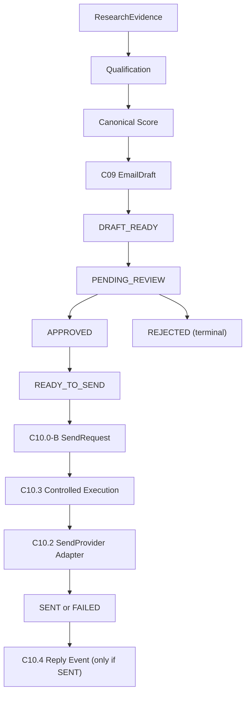

# Phase3C10 — Outreach Lifecycle Contract Freeze

## Scope

This marker freezes the C09–C10 outreach-lifecycle contract as it exists in
the repository on 2026-07-14. The frozen boundary is deterministic,
provider-agnostic, and validated with synthetic fixtures and in-memory
registries only.

This freeze does not authorize real outreach. It does not add SMTP, external
provider access, credentials, CRM writes, workflow execution, lead or
opportunity creation, automated approval, or AI approval.

## Completed phases

| Phase | Frozen responsibility |
| --- | --- |
| C09.1 | Read-only outreach-input facts from Lead intelligence, qualification, score, and evidence. |
| C09.2 | Deterministic evidence-backed EmailDraft boundary. |
| C09.3 | Limited draft-preparation projection contract for an existing Lead. |
| C09.4 | Synthetic C09 runtime acceptance. |
| C10.0-A | Deterministic ResearchEvidence identity and duplicate-safe persistence contract. |
| C10.0-B | Versioned SendRequest and idempotency contract. |
| C10.1 | Mandatory human approval state machine and immutable approval audit trace. |
| C10.2 | Provider-agnostic SendProvider adapter contract and provider-result trace. |
| C10.3 | Controlled execution orchestration requiring `READY_TO_SEND`. |
| C10.4 | Deterministic reply-event boundary preserving original send trace. |
| C10.5 | Synthetic end-to-end lifecycle acceptance, failure, trace, idempotency, and zero-side-effect coverage. |

The earlier C07 Evidence Intelligence and C08 Score Integration contracts are
inputs to this frozen lifecycle and remain frozen under their own phase
boundaries.

## Lifecycle diagram

Required trace continuity is:

`evidence references → score trace → draft ID → approval ID → send request ID → send attempt ID → reply event ID`.

## Known risks

- The C10 registries are in-memory reference implementations; they do not
  provide production durability, distributed locking, retention, or recovery.
- `SENT` in the current contract means a provider adapter returned
  `ACCEPTED`; it is not evidence of a real provider delivery, inbox placement,
  or recipient receipt.
- Reviewer identity is an explicit placeholder/identifier contract, not an
  integrated authentication, authorization, or segregation-of-duties system.
- C10 idempotency is contract-scoped. A future durable implementation must
  preserve versioned request identity across restarts and concurrent workers.
- Reply tracking validates source execution trace only; it does not establish
  an external webhook trust model, mailbox ownership, message authenticity, or
  consent status.

## Explicitly deferred items

- Real SMTP, provider SDK/API, provider credentials, webhooks, and delivery
  status reconciliation.
- Durable database-backed approval, execution, idempotency, and reply-event
  stores.
- CRM persistence or update behavior for approval, execution, delivery, or
  reply events.
- Authentication/ACL integration for reviewers, audit retention policy, and
  compliance controls.
- Campaign execution, follow-up, reply generation, sentiment analysis, score
  mutation, workflow execution, Lead creation, and Opportunity creation.
- Live-environment and real-customer acceptance testing.

## Future entry criteria

A subsequent phase may extend this frozen contract only when all of the
following are approved and documented before implementation:

1. A named scope that identifies the first permitted external side effect and
   explicitly excludes unrelated C07–C10 changes.
2. A version-compatible migration plan for C10.0-B request identity, C10.1
   approvals, C10.3 execution audit trace, and C10.4 reply-event identity.
3. A durable idempotency, concurrency, retry, and failure-recovery design.
4. Human reviewer authentication, authorization, audit-retention, and consent
   requirements suitable for the target environment.
5. Provider security design covering credentials, webhook verification,
   observability, data minimization, and reversible test controls.
6. New synthetic acceptance coverage proving no duplicate sends, no bypass of
   `READY_TO_SEND`, and preserved end-to-end traceability.
7. C09–C10 tests remain unchanged unless a separately approved contract
   version changes them, and the complete Regression Gate passes.

## Freeze verification

This marker changes documentation only. C10.0–C10.5 tests and Regression Gate
scripts are not modified by this phase. Their existing passing validation is
preserved as the freeze baseline.
