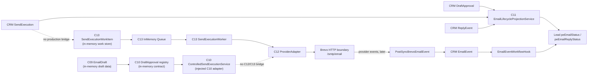

# Phase3C14.2A Send Simulation / Boundary Audit

## Audit Verdict

**BLOCKED**

This was a static, read-only audit. No test, API call, rebuild, cache operation, Docker operation, CRM write, provider call, or email send was performed.

C14.2B live testing is blocked until an isolated, explicitly wired path enforces the controlled test recipient and records which state boundary is authoritative.

## Send Path Diagram

The requested linear path is not implemented as one production runtime flow. The repository contains three separate boundaries:

`EmailEvent` is a post-send/provider-event ingestion record, not a pre-send connector step. It is created by `BrevoEmailEventSyncService` after an inbound event payload, then its hook projects to Lead and may create follow-up Tasks for replies or bounces.

## Entry Points and Boundaries

| Boundary | Entry point | Static behavior | Send capability |
|---|---|---|---|
| Draft generation | `DeterministicEmailDraftGenerator.generate()` | Creates an immutable draft contract only | None |
| C10 approval | `InMemoryHumanApprovalRegistry` | Human state transitions to `READY_TO_SEND` only | None |
| C10 execution | `ControlledSendExecutionService.execute()` | Calls an injected C10 `SendProviderAdapter` | Adapter-defined; no C12 bridge |
| C11 CRM projection | DraftApproval/SendExecution/ReplyEvent after-save hooks | Updates allowed Lead summary fields | None |
| C13 execution | `SendExecutionWorker.process()` | Claims an in-memory queue item and calls injected C12 `ProviderAdapter`; default is FakeProviderAdapter | Only if a real adapter is explicitly injected |
| C12 Brevo | `BrevoProviderAdapter.send()` | Builds transactional payload and calls `BrevoHttpClient.post_json('/smtp/email')` | Yes |
| Provider-event ingress | `PostSyncBrevoEmailEvent` | Creates deduplicated CRM EmailEvent records | None |
| Legacy event projection | `EmailEventWorkflowHook` | Updates Lead and may create reply/bounce Tasks | None |

Static construction references show that `BrevoProviderAdapter(...)`, `SendExecutionWorker(...)`, and `InMemorySendExecutionQueue(...)` are used only in tests. The C14.1.3 preflight loads configuration only; it does not instantiate the adapter or call `send()`.

## State Ownership Matrix

| State | Intended owner | Status values / trace | Writers | Assessment |
|---|---|---|---|---|
| Draft content | C09 draft and C11.4 DraftStore snapshot | subject, body, evidence references, content hash | Draft generator / store | Not persisted in CRM by this path |
| Approval decision | C11 CRM DraftApproval; C10 has a separate in-memory approval contract | CRM: PENDING, APPROVED, REJECTED; C10 also has DRAFT_READY and READY_TO_SEND | Human approval actions | Two representations are not bridged |
| Send lifecycle | C11 CRM SendExecution is the human-visible record | CREATED, READY, SENT, FAILED, CANCELLED | CRM saves and C11 hook projection | No C13 persistence adapter writes C13 results back to CRM |
| Worker lifecycle | C13 SendExecutionWorkItem and QueueItem | Work: READY/SENT/FAILED; Queue: QUEUED/CLAIMED/COMPLETED/FAILED | Explicit caller only | In-memory, isolated test/reference state |
| Provider result | C12 SendResult | SUCCESS/FAILED/RETRYABLE_FAILURE/PERMANENT_FAILURE and normalized error category | ProviderAdapter | Not automatically persisted to CRM SendExecution |
| Provider-event history | CRM EmailEvent | SENT, DELIVERED, OPENED, CLICKED, REPLIED, BOUNCED | PostSyncBrevoEmailEvent | Deduplicated by externalMessageId + eventType lookup |
| Reply history | CRM ReplyEvent | SENT, REPLIED, BOUNCED, UNSUBSCRIBED | CRM save | Separate from legacy EmailEvent history |
| Lead summary | Lead `peEmailStatus`, `peEmailReplyStatus`, `peLastEmailDate` | Sales read model | C11 projection and EmailEventWorkflowHook | Multiple writers: not a single projection authority |

## Isolation Verification

### Verified safe for this audit

- C14.1.3 preflight checks environment presence and loads `BrevoConfiguration` only; it has no ProviderAdapter, Queue, Worker, HTTP, Docker, or CRM invocation.
- C13 Worker defaults to `FakeProviderAdapter`.
- C13 queue/work store are process-local in-memory implementations.
- No non-test construction site exists for BrevoProviderAdapter, SendExecutionWorker, or InMemorySendExecutionQueue.
- No scheduler, daemon, cron, Redis/Celery, or background sender entry point was found in the C12/C13 scope.
- C11.5 retry fields are reservation-only; no `RETRYING` state or retry execution exists.

### Not protected by implementation

- C13 Worker has no `simulation` or `dry-run` flag. If an explicit caller injects BrevoProviderAdapter and calls `process()` with a READY work item, it will call `ProviderAdapter.send()`.
- C12 has no recipient override, allowlist, test-mailbox comparison, or production-recipient deny rule.
- `BREVO_TEST_RECIPIENT` has no use site in production code or the provider adapter.
- The outbound C13 work item is not wired to CRM SendExecution; static simulation cannot prove a CRM end-to-end send lifecycle.
- EmailEvent workflow creates CRM Tasks for REPLIED and BOUNCED events. It is inactive unless an EmailEvent is saved, but it is a later provider-event side effect to keep out of any isolated simulation.

## Brevo Integration Boundary

| Check | Result |
|---|---|
| API key loading | `BREVO_API_KEY` is read from process environment by `BrevoConfiguration`; missing value fails safely |
| Sender configuration | `BREVO_SENDER_EMAIL` and optional `BREVO_SENDER_NAME` are read from process environment |
| Payload builder | Sender comes from configuration; recipient, subject, and body come unchanged from C12 SendRequest |
| Test recipient protection | **Absent**: `BREVO_TEST_RECIPIENT` is not consumed |
| Production recipient protection | **Absent**: validation requires only a non-empty recipient |
| HTTP boundary | `UrllibBrevoHttpClient` is reachable only through `BrevoProviderAdapter.send()` and `/smtp/email` |
| Provider response | 200/201/202 require a non-empty provider message ID; 401/403, 429, timeout, 400, 5xx, and unknown responses are normalized |

## Risk Matrix

| Severity | Finding | Evidence | Required disposition before C14.2B |
|---|---|---|---|
| BLOCKER | No test-recipient enforcement or production-recipient protection | `BREVO_TEST_RECIPIENT` has no code use; payload uses `request.recipient` unchanged | Add/approve an isolated recipient guard before any real adapter invocation |
| BLOCKER | No production bridge from CRM SendExecution to C13 work item/queue/worker or back to CRM result | All C13 queue/worker constructions are test-only; work store is in-memory | Define the exact C14.2B synthetic path and prohibit claiming CRM end-to-end persistence |
| BLOCKER | C14.1 runtime acceptance was skipped and runtime credentials remain unavailable | C14.1/C14.1.3 status | Re-establish approved protected runtime and complete C14.1, or explicitly retain live acceptance as skipped |
| HIGH | C13 Worker calls any injected ProviderAdapter with no dry-run guard | `SendExecutionWorker.process()` invokes `self._provider.send()` after READY validation | C14.2B must use an isolated adapter selection and recipient guard; do not invoke Worker directly in audit mode |
| MEDIUM | Multiple Lead projection writers | C11 EmailLifecycleProjectionService and legacy EmailEventWorkflowHook both write `peEmail*` | Resolve or explicitly preserve RISK-C11.3-001 with deterministic precedence before CRM-connected live flow |
| MEDIUM | C10, C11, and C13 have parallel approval/execution representations | Separate in-memory contracts, CRM entities, and work-store models | Document authoritative path for any future operational send |
| LOW | Retry and recovery are reservation-only and process-local | No retry executor, durable queue, or distributed claim | Keep live test to one request; no retry/automatic resend |

## Remaining Risks Before C14.2B Live Test

1. C14.2B must not send until a recipient allowlist/override guarantees that the outbound recipient equals the controlled test mailbox.
2. The live test must declare whether it verifies only the isolated C12 adapter or a future CRM-to-worker bridge; the bridge is not implemented.
3. The operator must restore the protected acceptance runtime and explicitly authorize the single request; C14.1 remains skipped.
4. Provider-event ingress and legacy EmailEvent workflow must remain out of the test scope unless their Task/Lead side effects are separately authorized.
5. C11.3 multiple-writer risk must be accepted with a documented precedence rule before allowing a CRM-connected test.

## Scope Confirmation

Only static analysis and this audit document were produced. No code, migration, rebuild, cache operation, Docker change, API call, real email, or commit was performed.

