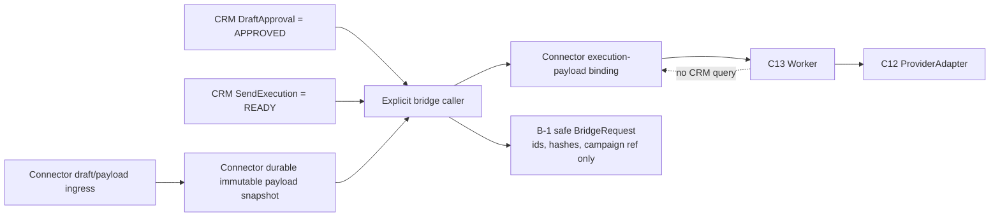

# Phase3C14.3.1B-3 Durable Payload Boundary Design

**Status:** DESIGN APPROVED FOR IMPLEMENTATION

## Decision

**RECOMMENDED_OPTION: A — Connector-owned immutable payload snapshot**

The connector must persist the approved delivery content in a connector-owned,
durable store before it can be made available to an execution worker.  CRM
continues to own the business approval decision and the human-visible
`SendExecution` record.  The Worker reads its execution payload exclusively
from the connector store; it must never query CRM.

This design resolves payload availability across a connector process restart.
It does **not** claim to make the current C13 in-memory Queue durable or add
crash/retry recovery.  Those remain separate, explicitly out-of-scope C13
limitations.

## Existing Facts and Non-Negotiable Boundaries

| Area | Confirmed fact | Boundary retained by this design |
|---|---|---|
| C10 | A duplicate request is identified by stable request identity; an explicit new `sendRequestId` is required for an authorized retry. | No C10 lifecycle or idempotency rule changes. |
| C11 | CRM `DraftApproval` carries `draftId` and `contentHash`; `SendExecution` is the CRM execution/audit record.  Neither holds recipient, subject, or body. | CRM retains approval and execution projection only. |
| C13 | The Worker already loads a `SendExecutionWorkItem` through `SendExecutionWorkStore`, then calls the ProviderAdapter. | A durable store is an implementation of the existing work-store seam; the Worker does not gain a CRM dependency. |
| C14.3.1B-2 | `ApprovedDeliveryPayloadSource` validates recipient, subject, body, draft id, content hash, and campaign reference, but its sole implementation is an in-memory fixture. | Replace the fixture at composition time; do not make the bridge request contain raw delivery content. |

The following remain prohibited: CRM `SendJob`, Lead projection changes,
EmailEvent writes, Worker-to-CRM reads or writes, Provider contract changes,
retry changes, Brevo changes, and real sending.

## Option Comparison

| Evaluation | A — Connector immutable snapshot | B — Extend `SendExecution` with payload fields | C — CRM durable payload entity |
|---|---|---|---|
| 1. C10 compatibility | **PASS.** Keeps payload persistence outside the frozen C10 request/lifecycle contract. | **RISK.** Payload and execution state become coupled to C10-adjacent CRM lifecycle vocabulary. | **RISK.** Adds another lifecycle beside C10 approval/execution. |
| 2. C11 ownership | **PASS.** CRM remains approval plus `SendExecution`; connector owns technical content storage. | **FAIL / high risk.** CRM becomes an email-content repository and overloads its audit record. | **FAIL.** A new CRM command/payload domain conflicts with the approved C11 simplification. |
| 3. C13 Worker compatibility | **PASS.** A durable implementation of the existing `SendExecutionWorkStore` supplies the same work item shape. | **RISK.** Worker would need a CRM payload read or a second connector copy, defeating the intended boundary. | **RISK.** Worker must query CRM or receive replicated CRM payload data. |
| 4. Idempotency | **PASS.** Unique connector execution binding is keyed by CRM execution id and preserves the B-1 stable key. | **RISK.** CRM identity plus queue/work-store identity require reconciliation. | **RISK.** Adds payload-record, job, execution, and queue identities to reconcile. |
| 5. Recovery after process restart | **PASS for payload existence.** A committed snapshot and execution binding remain readable by a new connector process. | **Partial.** Data can persist, but Worker isolation is lost or a second store is still needed. | **PASS technically, but at excessive domain and migration cost.** |
| 6. Security | **PASS.** Raw content remains in one restricted connector store; CRM and bridge requests retain only safe references/hashes. | **FAIL / high risk.** Recipient and message body become broadly available through CRM schema, API, backups, ACL/layouts, and audit surfaces. | **RISK.** Requires a new sensitive CRM entity, ACL model, layouts, API exposure review, and backup policy. |
| 7. Migration cost | **Low-to-medium.** Add connector storage adapter, schema, and tests; no CRM migration. | **Medium-to-high.** CRM metadata/schema/layout/ACL/provisioning migration, plus connector storage still needed for Worker isolation. | **High.** New CRM entity, metadata, layouts, ACL, relationships, provisioning, rollback, and reconciliation. |

### Rejected Options

**Option B** does not remove the need for connector-side data: the Worker must
still receive recipient, subject, and body without querying CRM.  It therefore
adds CRM schema risk without completing the isolation requirement.

**Option C** is expressly disallowed by the phase constraints (`SendJob` is
not permitted) and would turn CRM into a payload/queue coordination system.

## Recommended Architecture



### Ownership

| Record / action | Owner | Rules |
|---|---|---|
| Human approval | CRM `DraftApproval` | CRM is authoritative for `APPROVED`; the connector does not infer approval from stored content. |
| Human-visible execution trace | CRM `SendExecution` | CRM retains `CREATED`, `READY`, `SENT`, `FAILED`, `CANCELLED`; it holds no raw payload. |
| Payload snapshot and execution binding | Connector durable payload store | Stores the raw execution content and technical binding under restricted connector access. |
| Queue claim and Worker result state | C13 execution domain / durable work-store adapter | Worker reads and updates connector technical state only, then a separately approved result adapter may update CRM `SendExecution`. |
| Lead / EmailEvent | Existing owners only | This phase introduces no writer or path to either record. |

## Durable Store Contract

The production composition replaces `InMemoryApprovedDeliveryPayloadSource`
with a connector-owned durable implementation.  It is not a CRM repository
and must expose no CRM client to the Worker.

### Immutable payload snapshot

One snapshot is keyed by the immutable approved content identity:

| Field | Purpose |
|---|---|
| `snapshot_id` | Opaque connector identifier. |
| `draft_id` | Connector/CRM reference used for lookup only. |
| `content_hash` | Required SHA-256 value; must equal `DraftApproval.contentHash` at bridge admission. |
| `recipient` | Raw recipient, stored only in the restricted connector store and excluded from logs/repr. |
| `recipient_hash` | SHA-256 of normalized recipient; matches the B-1 safe request reference. |
| `subject`, `body` | Exact immutable provider-bound content. |
| `campaign_reference` | Required opaque campaign reference. |
| `generated_at` | Timezone-aware source timestamp. |
| `created_at` | Timezone-aware durable-store timestamp. |

The store permits `save_if_absent(snapshot)` only.  A repeat with exactly the
same immutable values returns the existing snapshot; a changed value for an
existing `draft_id + content_hash` fails closed with
`PAYLOAD_IMMUTABILITY_CONFLICT`.  It must never overwrite content in place.

The snapshot is written by an authorized connector payload-ingress path while
the full content still exists.  It is committed before any operational path
may mark the related CRM `SendExecution` ready for bridge admission.  CRM
approval remains independently verified later by B-2; snapshot persistence is
not itself an approval decision.

### Per-execution payload binding

The store also creates an immutable connector technical binding:

| Field | Purpose |
|---|---|
| `send_execution_id` | Unique bridge/C13 execution identity. |
| `send_request_id` | C10/C11 stable request identity, retained for the C13 `SendExecutionWorkItem`. |
| `snapshot_id` | The only pointer from execution to raw content. |
| `bridge_idempotency_key` | B-1 deterministic key for evidence and duplicate-safe admission. |
| `status` | Connector work-view status only: `READY`, then existing terminal `SENT` or `FAILED`. |
| terminal result fields | Existing safe provider message id or failure category and timestamp; no raw provider response. |

`bind_execution_if_absent(...)` is one transaction.  The unique key is
`send_execution_id`; replays succeed only when every immutable identity field
matches.  A mismatch fails closed with `EXECUTION_PAYLOAD_BINDING_CONFLICT`.
This is connector technical state, not a CRM `SendJob` and not an additional
CRM lifecycle.

The durable store supplies the existing `ApprovedDeliveryPayloadSource` lookup
and a durable implementation of the existing C13 `SendExecutionWorkStore`:

```text
Worker process(queue_item)
  -> durable work store get(send_execution_id)
  -> execution binding + immutable snapshot
  -> SendExecutionWorkItem(recipient, subject, body, draft_hash, request_id)
  -> ProviderAdapter
```

No Worker code needs a CRM repository, CRM URL, CRM credential, or CRM query.

## Admission, Integrity, and Atomicity

The explicit bridge caller keeps the B-2 admission checks and adds the durable
binding operation in this order:

1. Read CRM `SendExecution` and `DraftApproval` through the existing
   connector-side caller; require `READY` and `APPROVED`.
2. Read the durable snapshot by `draft_id`.
3. Require snapshot `draft_id`, `content_hash`, recipient/subject/body,
   campaign reference, and timestamps to be valid; require `content_hash` to
   equal the CRM approval hash.
4. Recompute and verify `recipient_hash`; construct the existing B-1 safe
   request without raw content.
5. Atomically create or verify the execution-payload binding.
6. Submit the B-1 request.  A future execution composer may enqueue the C13
   item only after the binding exists.

If snapshot lookup, validation, or binding fails, the bridge is `BLOCKED` and
no queue item or Provider call is made.  If an existing binding differs, it is
a terminal validation failure for that invocation; it is never repaired by
silently replacing the snapshot.

The bridge request continues to contain only `execution_id`, stable
idempotency key, `content_hash`, `recipient_hash`, campaign reference, and
timestamp.  Raw recipient, subject, and body do not enter the B-1 fixture,
queue identity, result callback, or CRM record.

## Restart and Recovery Semantics

| Event | Required behavior | Scope status |
|---|---|---|
| Bridge process restarts before binding | Durable immutable snapshot survives; later explicit admission can bind it after CRM approval/readiness is rechecked. | Solved by Option A. |
| Bridge process restarts after binding, before Worker processing | A new Worker process reconstructs the identical work item from the durable binding and snapshot, without CRM. | Payload availability solved; current in-memory C13 queue delivery remains a separate limitation. |
| Worker restarts before provider call | The payload remains verifiably present; a future durable queue/claim implementation is required to recover whether the item should be claimed. | Explicitly not solved in B-3. |
| Worker crashes after an ambiguous provider/network outcome | Preserve the established C14.2B terminal `NETWORK` interpretation; do not requeue, retry, or resend. | Unchanged. |
| A second bridge invocation occurs | Exact binding returns the existing binding; a different binding fails closed. | Solved by transactional uniqueness. |

Thus this phase's claim is deliberately narrow and testable: **the Worker can
load the exact approved payload after connector process restart, provided its
durable store is available.**  It does not claim end-to-end at-least-once or
exactly-once recovery while C13 Queue/claim state remains in-memory.

## Storage and Security Requirements

The implementation must use a connector-owned persistent backing store shared
by the explicit bridge process and Worker process.  For a single-host
connector deployment, a transactional SQLite database on a connector-managed
persistent volume is sufficient.  A multi-host deployment must use one
connector-owned shared durable database; a copied local file or network share
is not an acceptable substitute for transactional shared storage.

Minimum controls:

- restrict filesystem/database access to the connector service identity;
- store raw content only in the payload snapshot table/collection, never in
  CRM, B-1 bridge requests, C13 queue identifiers, logs, exceptions, test
  assertion messages, or result callbacks;
- use parameterized storage operations and prohibit payload fields from
  diagnostic logging;
- persist hashes and safe identifiers in technical audit records; retain only
  sanitized failure codes and provider message ids;
- encrypt the persistent volume or database at rest using the deployment's
  existing key-management control, with no key material embedded in payload
  rows or source code;
- require a retention/deletion policy that removes raw snapshots only after
  the relevant execution is terminal and no approved operational retention
  obligation remains.  Deletion must not alter CRM records or reuse the
  execution identity.

## Migration and Implementation Scope

No CRM schema, entity, metadata, layout, ACL, Lead projection, EmailEvent
writer, ProviderAdapter, retry strategy, or Brevo component changes are
required.

Implementation may add only connector-side artifacts needed to satisfy this
design:

1. durable snapshot and execution-binding storage adapter plus migration;
2. `ApprovedDeliveryPayloadSource` implementation backed by that adapter;
3. `SendExecutionWorkStore` implementation backed by the binding/snapshot;
4. explicit composition wiring that remains outside CRM PHP hooks; and
5. deterministic tests using a temporary persistent store (no provider call).

The implementation must not repurpose `InMemoryDraftStore` as production
storage.  It may reuse its immutable-hash principles, but a new payload
snapshot is necessary because the B-2 payload includes a raw recipient and
campaign reference that C11.4's DraftStore contract deliberately does not
carry.

## Required Verification Before Closing Implementation

1. Persist an approved payload, discard the source process/object, reopen the
   durable store in a new process, and prove the exact payload is retrievable.
2. Re-open the durable store through the C13 work-store adapter and prove that
   the Worker obtains a complete `SendExecutionWorkItem` without any CRM
   repository/client call.
3. Re-submit the same execution and prove one immutable binding and the same
   B-1 idempotency key; submit a changed snapshot/binding and prove fail-closed
   behavior.
4. Prove raw recipient, subject, and body are absent from B-1 request objects,
   queue records, safe outcomes, error messages, and CRM-shaped records.
5. Run existing C10, C11, C13, B-1, and B-2 regression tests, plus new durable
   boundary tests.  Use FakeProvider only; do not execute a real send.
6. Document the persistent-volume/database availability prerequisite and
   report C13 queue crash-recovery as `DEFERRED`, not solved by payload
   persistence.

## Implementation Gate

**READY_FOR_IMPLEMENTATION: YES — limited to the connector-owned durable
payload boundary described above.**

Readiness does not authorize a CRM `SendJob`, payload fields on
`SendExecution`, Worker-to-CRM access, result-adapter implementation, durable
queue/retry work, Provider/Brevo changes, or real sending.  If the deployment
cannot provide a persistent connector-owned store shared by the bridge and
Worker processes, implementation must stop as `BLOCKED` rather than fall back
to in-memory storage or CRM payload persistence.
