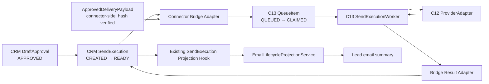
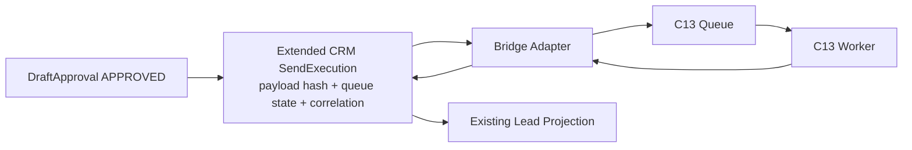
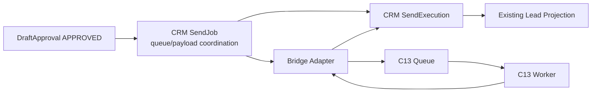

# Phase3C14.3.1B Architecture Decision

## Decision

**RECOMMENDED_OPTION: A — Minimal Bridge Contract**

Option A is the smallest stable boundary that preserves the C10/C11/C12/C13/C14.2B contracts:

- reuse the existing CRM `SendExecution` as the only CRM execution/audit record;
- introduce no new CRM entity;
- keep delivery content outside CRM and behind a connector-owned approved-payload boundary;
- keep C13 QueueItem/claim state inside the C13 execution domain;
- let the Worker return a result only to a bridge-owned result adapter;
- allow only the existing `SendExecution` projection hook to update the Lead through `EmailLifecycleProjectionService`.

This is a design decision only. No code, metadata, database, runtime, or Git change was made.

## Non-Negotiable Boundary

```text
Worker
  -> may update only bridge-owned execution/queue state
  -> may not update Lead
  -> may not create or update EmailEvent
  -> may not create or update ReplyEvent

Bridge result adapter
  -> updates CRM SendExecution only

Existing SendExecution projection hook
  -> EmailLifecycleProjectionService
  -> Lead email summary only
```

C14.3.1A's single-writer rule remains intact: `EmailLifecycleProjectionService` is the only CRM-extension writer of `Lead.peEmailStatus` and `Lead.peEmailReplyStatus`.

---

# Option A — Minimal Bridge Contract

## Architecture Diagram



## State Ownership

| State | Owner | Notes |
|---|---|---|
| DraftApproval decision | CRM DraftApproval | `APPROVED` remains a CRM human-decision record. It is not rewritten into C10 `READY_TO_SEND`. |
| CRM SendExecution coarse lifecycle | CRM SendExecution | `CREATED`, `READY`, `SENT`, `FAILED`, `CANCELLED`; source of human-visible execution trace. |
| Approved delivery payload | Connector approved-payload boundary | Holds recipient, subject, body, draft ID, content hash, and generated time; never stored in Lead or EmailEvent. |
| Queue state / claim | C13 Queue | `QUEUED`, `CLAIMED`, `COMPLETED`, `FAILED`; process-local under current C13 contract. |
| Work-item state | C13 WorkStore | `READY`, `SENT`, `FAILED`; provider invocation input/output only. |
| Provider result | C12 ProviderAdapter result | Returned to bridge; Worker does not write CRM. |
| Lead email summary | EmailLifecycleProjectionService | Projection only, after CRM SendExecution save. |

## Entity Ownership

No new entity is required.

Existing entities are sufficient for CRM-side ownership:

| Entity | Role in Option A |
|---|---|
| DraftApproval | Approval/audit source only. It contains the approved draft identity and content hash reference; it does not hold delivery content. |
| SendExecution | CRM execution/audit record and result callback target. It remains the only CRM execution record. |
| ReplyEvent | Unchanged; not created by the Worker. |
| Lead | Read-model only; never an execution command source. |

The connector-side `ApprovedDeliveryPayload` is a contract object, not a CRM entity. It must be obtained from a durable implementation behind the existing DraftStore-style boundary before an operational bridge is enabled.

## Minimal Bridge Contract

The bridge receives an explicitly authorized execution request:

```text
BridgeExecutionRequest
  crmSendExecutionId
  sendRequestId
  draftApprovalId
  draftId
  approvedContentHash
  leadId
  ApprovedDeliveryPayload(recipient, subject, body, generatedAt, contentHash)
```

Required preconditions:

1. CRM DraftApproval is `APPROVED`.
2. CRM SendExecution is `READY`.
3. `approvedContentHash` equals the payload content hash.
4. The payload draft ID equals DraftApproval draft ID.
5. `sendRequestId` is non-empty and unique.
6. The bridge has not already observed a terminal result for that send request.

The bridge does **not** reinterpret CRM `APPROVED` as the frozen C10 `READY_TO_SEND` state. CRM `SendExecution.READY` is its own explicit execution-readiness record and must be set by an authorized future bridge caller after payload verification.

## Payload Freezing

The payload must be frozen before enqueue:

```text
Draft snapshot
  -> content hash
  -> human approval reference
  -> Bridge verifies draft ID + content hash
  -> immutable ApprovedDeliveryPayload
  -> C13 SendExecutionWorkItem
```

The CRM entities retain only IDs, hash, and trace metadata. Recipient, subject, and body remain connector-side; they must not be written to Lead, EmailEvent, ReplyEvent, or CRM SendExecution.

The current `InMemoryDraftStore` is not a stable operational source across processes. A later implementation needs a durable DraftStore adapter or another approved connector-side payload repository. This is a prerequisite, not an invitation to add a CRM content entity.

## Idempotency Model

| Boundary | Identity / rule |
|---|---|
| CRM SendExecution | Existing unique `sendRequestId` is the stable CRM execution identity. |
| Bridge request | `sendRequestId` plus the verified `draftId/contentHash` pair. A mismatch fails safely. |
| C13 Queue | Existing one QueueItem per `send_execution_id`. |
| C13 Worker | Existing non-QUEUED item cannot be claimed again. |
| Provider Adapter | Existing request/execution identity behavior remains unchanged. |
| Result callback | Only the matching `crmSendExecutionId + sendRequestId` may update CRM; a terminal CRM state cannot be reopened or automatically re-enqueued. |

An ambiguous `NETWORK` failure is terminal for this bridge invocation. It must not enqueue a second item or retry automatically.

## Result Callback

```text
WorkerExecutionOutcome
  -> Bridge Result Adapter
  -> CRM SendExecution only:
       status = SENT or FAILED
       providerMessageId when available
       failureCategory when failed
       lastError safe code only
  -> existing SendExecution projection hook
  -> EmailLifecycleProjectionService
  -> Lead summary
```

The bridge result adapter must not set Lead fields. It must not create EmailEvent or ReplyEvent. Those records retain their own source boundaries.

## Failure Handling

| Event | Bridge action |
|---|---|
| Approval not APPROVED / execution not READY | Reject before enqueue; no Worker call. |
| Payload missing or hash mismatch | Reject before enqueue; no Worker call. |
| Duplicate sendRequestId | Return existing execution identity; no second QueueItem. |
| Queue validation/claim failure | Keep CRM execution non-SENT; record safe FAILED outcome only if bridge has a valid terminal failure. |
| Provider AUTH/RATE_LIMIT/VALIDATION/PROVIDER/UNKNOWN | Preserve existing C11.5 category and map CRM SendExecution to FAILED. |
| Provider NETWORK / C14.2B ambiguity | Map to terminal FAILED/NETWORK; no re-enqueue, retry, or resend. |
| Callback persistence failure | Never claim SENT without durable CRM result evidence; surface bridge failure for manual handling. |

## Migration Cost

**Low-to-medium, but with a hard prerequisite.**

- No CRM schema migration or new entity is required.
- No Queue/Worker/Provider contract modification is required.
- A new connector-side bridge and a durable approved-payload source must be separately approved and implemented.
- An explicit invocation owner is required; no implicit PHP hook-to-Python in-memory call is valid.

## Compatibility

| Area | Compatibility |
|---|---|
| C10 freeze | Compatible. No change to HumanApprovalRegistry, ControlledSendExecutionService, or C10 provider contract. CRM APPROVED is not relabeled as C10 READY_TO_SEND. |
| C11 projection | Compatible. CRM SendExecution remains the source record; existing projection hook remains the only Lead path. |
| C13 Worker | Compatible. Uses Queue, WorkStore, and Worker as-is; no Worker method or state change. |
| C14.2B error handling | Compatible. NETWORK remains terminal for this controlled invocation; no automatic retry. |

---

# Option B — Extend Existing SendExecution

## Architecture Diagram



## Proposed Extension

Add to CRM SendExecution:

- queue state;
- delivery payload hash;
- worker correlation ID;
- provider-result trace fields beyond the current status/message/failure fields.

## State and Entity Ownership

CRM SendExecution would own both human-visible execution state and additional worker/queue substate. C13 QueueItem would still own claim atomicity, creating two representations of queue state.

## Idempotency Model

The existing `sendRequestId` unique index remains useful, but each new queue/correlation field creates a second synchronization problem:

```text
CRM queue state != C13 QueueItem state
  -> reconciliation rule required
  -> potential duplicate/enqueue ambiguity
```

A payload hash alone does not provide the recipient, subject, or body required by the C13 WorkItem. A connector-side payload source is still required.

## Failure Handling

Provider result fields already exist in CRM SendExecution:

- `providerMessageId`
- `failureCategory`
- `lastError`
- `status`

Adding further fields does not change C13 failure handling and does not resolve ambiguous network outcomes. It risks making CRM appear to own Worker claim/retry mechanics that remain in C13.

## Migration Cost

**Medium-to-high.**

- CRM metadata/schema migration and extension rebuild are required.
- Existing SendExecution layouts, ACL, projection tests, and provisioning must be updated.
- Historical records require nullable/default-safe migration handling.
- A connector payload source and result adapter are still required.

## Compatibility

| Area | Compatibility assessment |
|---|---|
| C10 freeze | Can avoid direct C10 code changes, but state terminology risks conflating CRM APPROVED with C10 READY_TO_SEND. |
| C11 projection | Risk: more CRM intermediate state can inadvertently project to Lead and alter C11 ordering expectations. |
| C13 Worker | Does not break C13 code directly, but creates duplicate queue-state authority. |
| C14.2B error handling | Must retain terminal network behavior; additional queue state may encourage unsafe recovery/retry logic. |

## Assessment

Not recommended. It expands schema without solving the required approved-payload or cross-process bridge boundary, and it increases duplicated state ownership.

---

# Option C — Introduce SendJob Entity

## Architecture Diagram



## State and Entity Ownership

A new CRM SendJob would hold queue-orchestration state between DraftApproval and SendExecution. SendExecution would remain provider-result history, while SendJob would become a durable command/queue record.

This duplicates the C13 QueueItem concept in CRM and adds a third lifecycle layer:

```text
DraftApproval -> SendJob -> SendExecution -> QueueItem -> WorkItem
```

## Idempotency Model

A SendJob would need its own unique identity, relation to DraftApproval, relation to SendExecution, and correlation to C13 QueueItem. It would require explicit reconciliation rules for terminal failures and duplicate approval signals.

## Failure Handling

A SendJob would need to decide whether a failed queue/provider action is terminal, retryable, cancelled, or manually recoverable. That overlaps C11.5/C13 responsibility and creates pressure to add retry scheduling, which this program explicitly forbids.

## Migration Cost

**High.**

- New CRM entity, metadata, layouts, ACL, relationships, provisioning, and migration.
- Additional API/UI/reporting state.
- New projection/ordering considerations.
- Larger rollback surface and higher risk of accidentally treating CRM as a queue service.

## Compatibility

| Area | Compatibility assessment |
|---|---|
| C10 freeze | Adds a parallel lifecycle adjacent to C10 approval/execution, increasing semantic drift risk. |
| C11 projection | Requires deciding whether SendJob projects to Lead; that threatens the single-writer and source-of-truth simplification. |
| C13 Worker | Duplicates C13 QueueItem responsibility rather than reusing it. |
| C14.2B error handling | Requires new durable retry/recovery semantics for ambiguous network failures. |

## Assessment

Not recommended. It is over-designed for the current program and contradicts the goal of reusing SendExecution as the human-visible execution record.

---

# Comparative Decision Matrix

| Criterion | Option A: Minimal Bridge | Option B: Extend SendExecution | Option C: SendJob entity |
|---|---|---|---|
| New CRM entity | No | No | Yes |
| CRM schema migration | No | Yes | Yes |
| Reuses SendExecution | Yes | Yes, but overloaded | Partially |
| Preserves C13 Queue ownership | Yes | No, duplicates state | No, duplicates state |
| Needs connector payload source | Yes | Yes | Yes |
| Keeps Worker away from Lead/events | Yes | Yes, if enforced | Yes, but more callback paths |
| C10/C11/C13 contract risk | Lowest | Medium | High |
| Rollback surface | Small | Medium | Large |
| Future email extensibility | Good via payload/bridge interface | Moderate, CRM-bound | Broad but excessive |

# Recommendation Rationale

Option A is recommended because it makes the fewest changes, preserves frozen contracts, is testable using FakeProviderAdapter and in-memory C13 components, and has the smallest rollback surface.

It also supports future email extensions without treating CRM as a delivery-content store or a queue service:

```text
Future provider/queue implementations
  -> remain behind C12/C13 contracts

Future durable payload storage
  -> remains behind connector-owned approved-payload/DraftStore boundary

CRM
  -> remains approval, audit, and human-visible projection state
```

## Preconditions Before Option A Implementation

Implementation must not start until all of the following are explicitly approved:

1. A connector-owned `ApprovedDeliveryPayload` contract and durable source are authorized.
2. An explicit invocation owner for the bridge is named; no PHP hook may directly invoke a Python in-memory queue.
3. CRM SendExecution `READY` is approved as the bridge-entry state without redefining C10 `READY_TO_SEND`.
4. A result adapter is approved to update CRM SendExecution only.
5. No automatic retry or resend is introduced for C14.2B ambiguous network failures.

