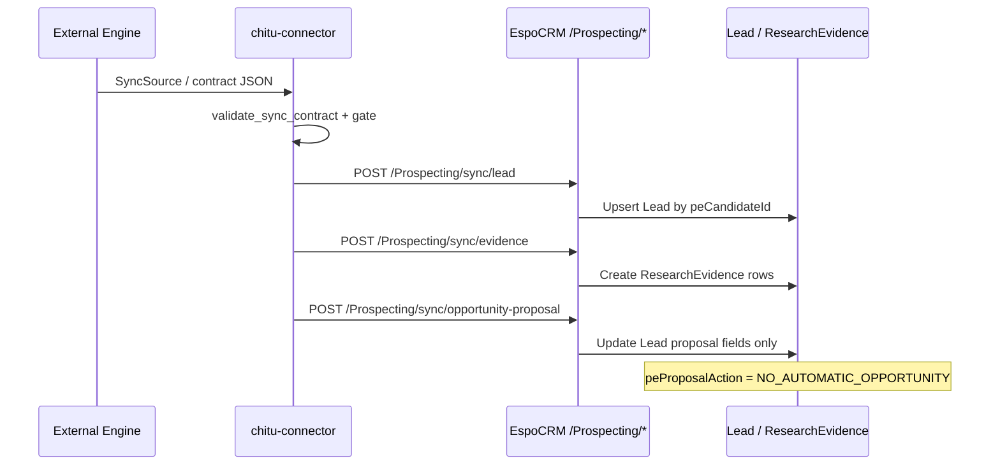
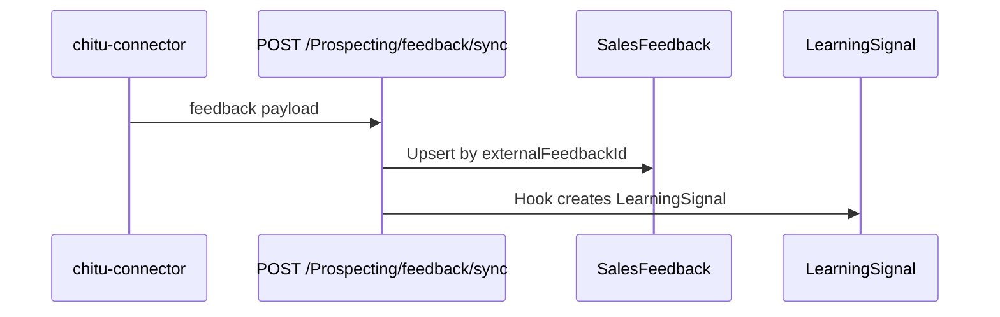
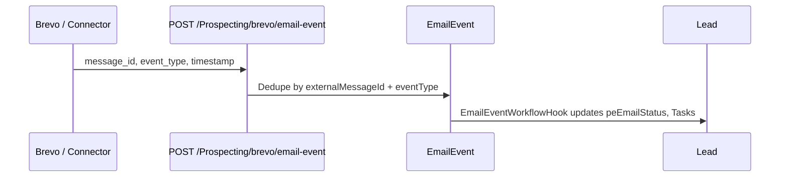
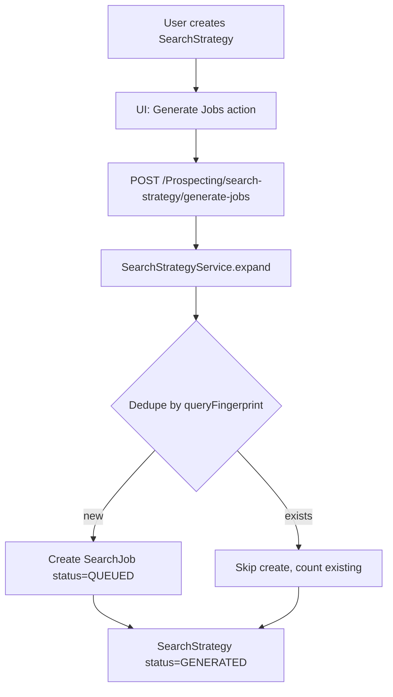
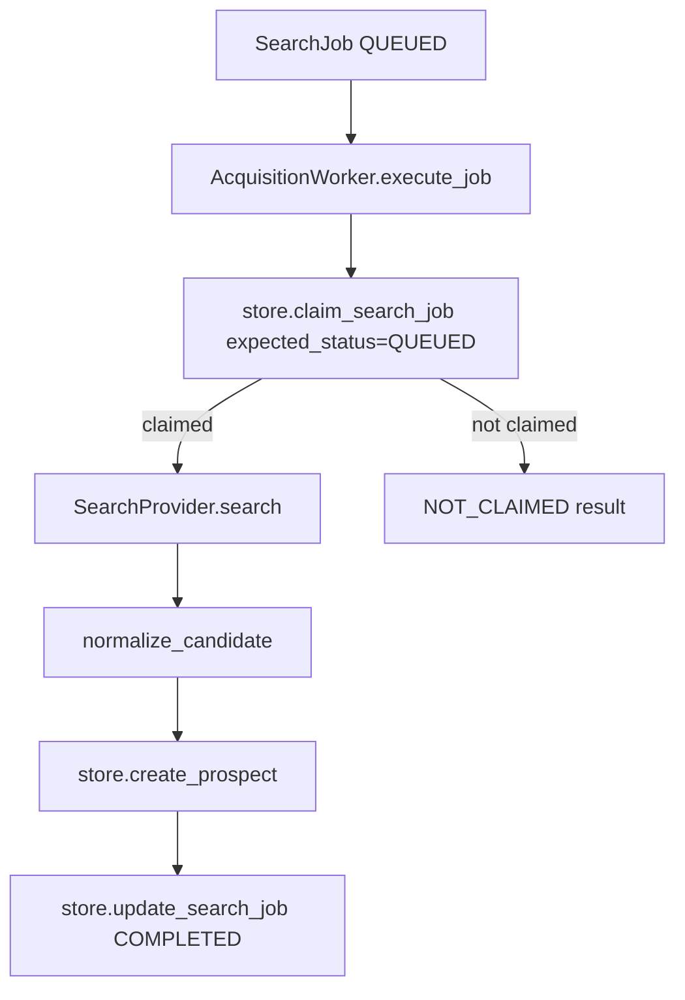

# Data Flow

**Status:** Mixed — sync path **Implemented**; acquisition runner **Implemented** (fake provider + Espo REST adapter, static tests); live multi-runner and real providers **Not Implemented**

## 1. Chitu Sync Pipeline (Implemented)

One-way intelligence projection from connector to CRM.

**Source files:**

- Connector: `chitu-connector/chitu_connector/espocrm_sync/connector_api.py`
- CRM: `crm-extension/files/custom/Espo/Modules/Prospecting/Services/ChituSyncService.php`

**Contract version:** `contract_version: "1.0"` required by `ChituSyncService::payload()`.

## 2. Feedback Loop (Implemented)

**CRM hook:** `SalesFeedbackLearningSignalHook.php` (referenced by tests).

## 3. Brevo Email Events (Implemented)

Append-only event ingestion — **does not send email**.

**Note:** This is a custom REST ingestion endpoint, not a generic EspoCRM webhook framework.

## 4. Search Strategy → Search Jobs (Implemented)

**Limits:** Max 40 jobs per expansion (`SearchStrategyTemplates::MAX_JOBS`).

## 5. Acquisition Worker (Partial)

**Worker Core — Implemented** (`chitu_connector/acquisition/worker.py`):

**EspoCRM adapter — Implemented (MVP, fake provider only):**

- `EspoAcquisitionRepository` in `chitu-connector/chitu_connector/acquisition/espo_repository.py`
- CLI: `python -m chitu_connector.acquisition.runner run-job --job-id <id> --provider fake`
- Uses standard EspoCRM REST (`GET/PUT SearchJob`, `POST ProspectPool`) with GET-then-PUT claim
- **Runtime Verified:** deferred per [PHASE3C02_2C_JOB_RUNNER_REPORT.md](../PHASE3C02_2C_JOB_RUNNER_REPORT.md)
- Design background: [PHASE3C02_2C_JOB_RUNNER_DESIGN.md](../PHASE3C02_2C_JOB_RUNNER_DESIGN.md)

## 6. ProspectPool → Lead (Not Implemented)

`ProspectPool` has `crmPushStatus` and queue stages (`DISCOVERY` → `CRM`) but:

- No PHP service bridges ProspectPool to `ChituSyncService`
- No worker writes ProspectPool from search results in production code path
- Audit: [PHASE3C02_2A_ACQUISITION_RUNTIME_BOUNDARY_AUDIT.md](../PHASE3C02_2A_ACQUISITION_RUNTIME_BOUNDARY_AUDIT.md)

## 7. Explicitly Forbidden Automatic Behaviors

| Behavior | Status | Evidence |
|----------|--------|----------|
| Auto-create Opportunity from proposal | **Blocked** | `ChituSyncService::syncOpportunityProposal` sets `NO_AUTOMATIC_OPPORTUNITY`; tests assert no `getEntity('Opportunity')` |
| Store full email body on Lead | **Not stored** | `peEmailSubject` / `peEmailBody` absent from Lead entityDefs |
| CRM → Engine score writeback | **Out of scope** | Sync contract boundary V1 |
| Old Chitu-intelligence runtime in CRM | **Not used** | Extension tests assert no `prospecting_engine/` overlap |

## 8. CAS / ETag (Not Implemented)

`AcquisitionStore` documents optional `expected_version` for future compare-and-set. No EspoCRM ETag or atomic claim API exists in `crm-extension` routes today. C02.2C design allows GET-then-PUT for single-runner MVP.

## Related Documents

- [BOUNDARIES.md](BOUNDARIES.md)
- [../api/REST_ENDPOINTS.md](../api/REST_ENDPOINTS.md)
- [../sync-contracts/ESPOCRM_SYNC_CONTRACT_BOUNDARY_V1.md](../sync-contracts/ESPOCRM_SYNC_CONTRACT_BOUNDARY_V1.md)
