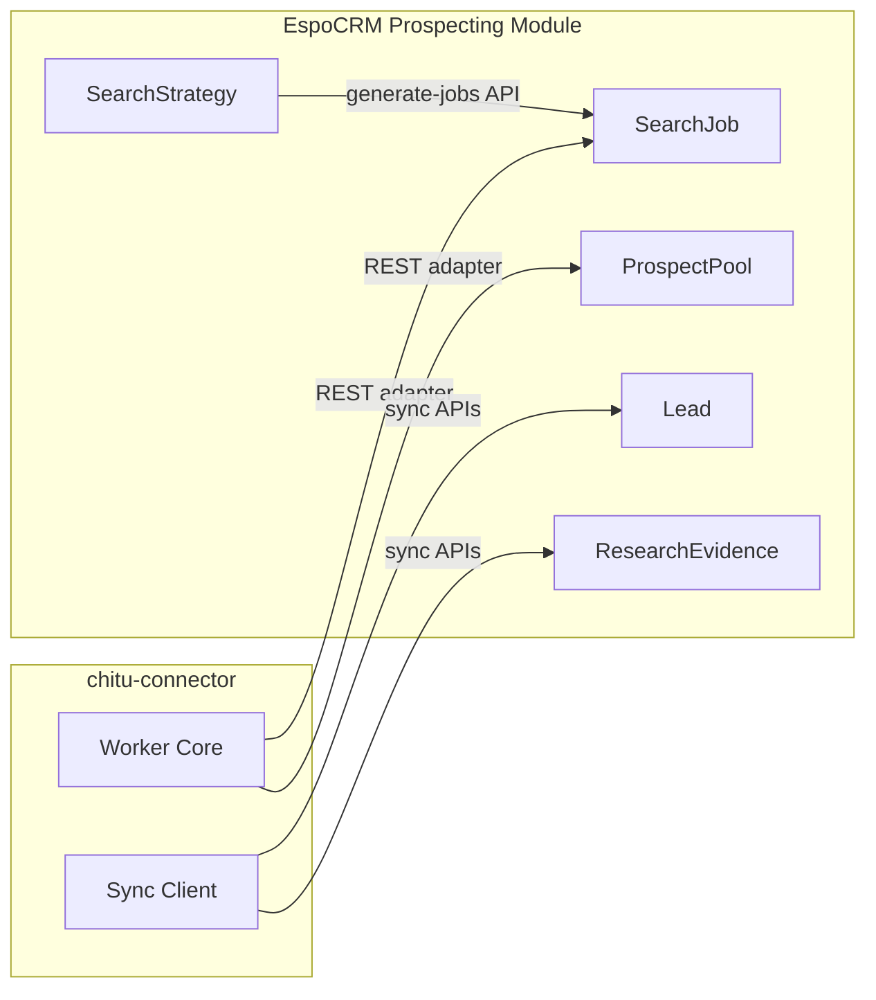

# System Overview

**Status:** Static Verified (structure and modules); partial Runtime Verified per phase reports  
**Packaged extension version:** `1.9.7-alpha` (version authority: `crm-extension/manifest.json`)

## Purpose

The EspoCRM Production workspace integrates **Chitu prospecting intelligence** into EspoCRM through:

1. A **CRM Extension** (`crm-extension/`) — EspoCRM module `Prospecting` with entities, UI, sync APIs, and workflow hooks.
2. A **Chitu Connector** (`chitu-connector/`) — Python library that validates sync contracts, calls EspoCRM REST endpoints, and hosts the **Acquisition Worker Core**.
3. **Deployment assets** (`deployment/`) — extension ZIP artifacts, provisioning scripts, and validation tests.

This repository does **not** vendor EspoCRM core. It ships an installable extension package and a standalone connector.

## Implemented Components

| Component | Location | Role |
|-----------|----------|------|
| Prospecting module | `crm-extension/files/custom/Espo/Modules/Prospecting/` | CRM entities, layouts, ACL, custom APIs |
| Chitu sync service | `ChituSyncService.php` | Lead, ResearchEvidence, opportunity proposal projection |
| Feedback sync | `FeedbackSyncService.php` | SalesFeedback + LearningSignal ingestion |
| Brevo email events | `BrevoEmailEventSyncService.php` | Append-only EmailEvent ingestion |
| Search strategy planner | `SearchStrategyService.php` | Expands SearchStrategy → SearchJob records |
| Connector client | `chitu_connector/espocrm_sync/` | HTTP client for `/Prospecting/*` sync routes |
| Worker core | `chitu_connector/acquisition/worker.py` | Executes a single SearchJob against an injectable store + provider |
| Vendored contracts | `chitu_connector/vendored/` | Stable interfaces imported by connector only |

## Domain Entities (CRM)

| Entity | Status | Notes |
|--------|--------|-------|
| **Lead** | Implemented (extended) | Native Lead + `pe*` intelligence and workflow fields |
| **ResearchEvidence** | Implemented | Evidence projection from sync contract |
| **SearchStrategy** | Implemented | Acquisition planning; generates SearchJobs |
| **SearchJob** | Implemented | Discovery job queue metadata (`QUEUED` … `CANCELLED`) |
| **ProspectPool** | Implemented (metadata) | Raw prospect queue; **no automatic population from search yet** |
| **SalesFeedback** | Implemented | Connector-synced sales outcomes |
| **LearningSignal** | Implemented | Generated from SalesFeedback hook |
| **EmailEvent** | Implemented | Brevo/connector email execution events |
| **Opportunity** | Implemented (extended) | Native CRM + `pe*` fields; **not auto-created from proposals** |

## Acquisition vs Sync

Two parallel tracks exist by design:

- **SearchStrategy → SearchJob** — **Implemented** in CRM (`PostGenerateSearchStrategyJobs`).
- **SearchJob → ProspectPool** — **Implemented** in connector (`EspoAcquisitionRepository` + fake provider CLI). **Runtime Verified** against live CRM deferred.
- **ProspectPool → Lead** — **Not Implemented** — no bridge to `ChituSyncService`

## Packaged capability boundary (v1.9.7-alpha)

| Area | State |
|------|-------|
| Phase 3B — CRM sync, email, feedback, workspace UI | Largely **Implemented** and covered by extension skeleton tests |
| Phase 3C01 — Acquisition workspace metadata | **Implemented** |
| Phase 3C02.1 — Acquisition ACL provisioning script | **Implemented** (script present; execution is manual) |
| Phase 3C02.2B — Worker Core | **Implemented** (connector package) |
| Phase 3C02.2C — Job runner + EspoCRM repository adapter | **Implemented** (fake provider; offline tests) |

The current `1.9.7-alpha` package baseline includes the C16.1A entity skeleton only; later C16 workflow work remains un-packaged.

## What This Workspace Does Not Include

- EspoCRM application core (`application/Espo/`)
- Live Chitu scoring or AI research runtime (connector imports vendored contracts only)
- Automatic Opportunity creation (`NO_AUTOMATIC_OPPORTUNITY` is enforced in `ChituSyncService`)
- Production credentials or hosted CRM configuration

## Related Documents

- [MODULES.md](MODULES.md)
- [DATA_FLOW.md](DATA_FLOW.md)
- [BOUNDARIES.md](BOUNDARIES.md)
- [PHASE3C02_2A_ACQUISITION_RUNTIME_BOUNDARY_AUDIT.md](../PHASE3C02_2A_ACQUISITION_RUNTIME_BOUNDARY_AUDIT.md)
