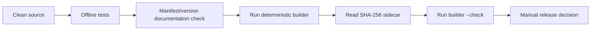
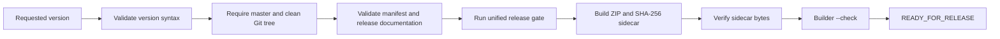

# Phase3S02.3 — Release Automation Stabilization Report

## Problem

The release prerequisites already existed, but they were separate manual commands. A release operator could run a builder without first proving the Git baseline, version documentation, required gate, and canonical artifact verification were all valid.

## Previous manual flow



The underlying commands remain supported: `scripts/testing/run-unified-gate.ps1`, `crm-extension/scripts/build_release_package.py`, `crm-extension/scripts/build_release_package.ps1`, and the existing test runners are unchanged.

## New automated flow

`scripts/release.ps1` is a fail-fast wrapper; it does not alter source, manifest data, version metadata, or product/runtime behavior.



`-DryRun` keeps the same baseline, version, gate, checksum, and artifact-verification checks, but skips ZIP/sidecar generation and verifies the existing canonical artifact instead. It never tags, commits, pushes, or changes the requested version.

## Files changed

- `scripts/release.ps1` — unified release entry point.
- `docs/release/PHASE3S02_3_RELEASE_AUTOMATION_REPORT.md` — this report.

## Usage

Run a release build only after preparing a clean, version-consistent release baseline:

```powershell
.\scripts\release.ps1 -Version 1.9.7-alpha -PythonExecutable .\.venv-s01\Scripts\python.exe
```

Validate the current canonical release without generating a new artifact:

```powershell
.\scripts\release.ps1 -Version 1.9.6-alpha -PythonExecutable .\.venv-s01\Scripts\python.exe -DryRun
```

## Validation result

PASS — the unified `offline` profile completed successfully: extension pytest (75), connector pytest (279), root/runtime pytest (162), S01 integrity pytest (12), package baseline pytest (5), extension unittest (75), artifact check, and deployment validation all passed.

PASS — an invalid version (`invalid-version`) stopped before Git and build activity with exit code 2. A dirty working tree stopped before version/gate/build activity with exit code 3. A clean-tree dry run for `1.9.6-alpha` completed the release profile and existing-artifact verification, ending with `READY_FOR_RELEASE`.

The release wrapper emits `STOP` and a non-zero exit code for every failed prerequisite.

No formal release, tag, or version change is created by this Phase3S02.3 work.
