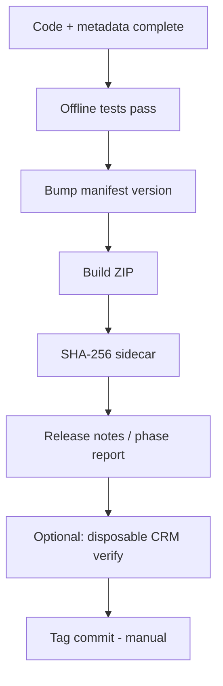

# Release Process

**Status:** Documented procedure — **not executed** by documentation tasks

## Overview



## Steps

### 1. Pre-release audit

```powershell
git status --short
python -m unittest crm-extension.tests.test_extension_skeleton -v
python -m unittest discover -s chitu-connector/tests -p "test_*.py" -v
```

Confirm working tree matches intended release scope.

### 2. Version bump

Edit `crm-extension/manifest.json`:

- `version`
- `releaseDate`

Update `test_extension_skeleton.py` version assertion if not already aligned.

### 3. Build package

```powershell
cd crm-extension
.\scripts\build_release_package.ps1 -OutputPath ..\deployment\prospecting-extension-<version>.zip
```

### 4. Checksum

Record SHA-256 in `deployment/prospecting-extension-<version>.zip.sha256`.

### 5. Documentation

- Add `docs/release/RELEASE_NOTES_<version>.md` and update `docs/release/README.md`
- Update `docs/README.md` current status table

### 6. Runtime verification (disposable CRM)

- Install ZIP
- Run targeted manual tests ([../testing/MANUAL_TESTS.md](../testing/MANUAL_TESTS.md))
- Run provisioning scripts if ACL/dashboards changed

### 7. Git tag (manual, out of band)

Suggested: tag matches extension version after commit. This repository does not auto-tag.

### 8. Rollback materials

Keep previous ZIP + SQL backup references per [../deployment/ROLLBACK.md](../deployment/ROLLBACK.md).

## Worktree Hygiene

Before release, check for parallel unstaged work in `crm-extension/` or `deployment/` that should not ship.

## Related Documents

- [../deployment/PACKAGE.md](../deployment/PACKAGE.md)
- [../testing/CHECKLIST.md](../testing/CHECKLIST.md)
- [CHANGELOG_POLICY.md](CHANGELOG_POLICY.md)
